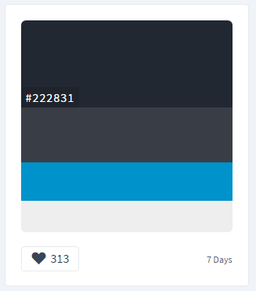
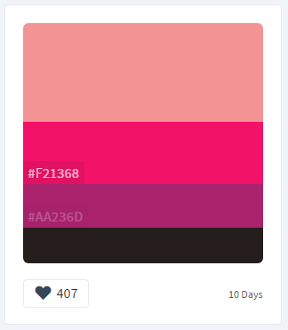
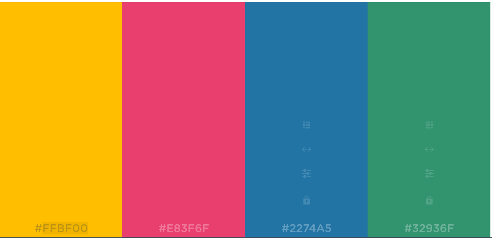

# Base maps using MapBox

> Spring 2017 | Geography 472/572 | Geovisualization: Geovisual Analytics
>
> Presenter: Paulo Murillo
>
> Instructor: Bo Zhao | TA: Kyle R. Hogrefe | Location: LINC 368 | Time: Tuesday/Thursday 9-9:50am
>
> ------
>
> ## Base Map Inspiration I

I developed this base map using some basic colors from http://www.colorhunt.co/.

  

I combined two different schemes to generates a colorful base-map.

[Here](http://cdn.rawgit.com/paulomur/MapBox_BaseMaps/7ee0c83c/map1.html) you can find my Base map 1.

## Base Map Inspiration II

Using colors from https://coolors.co/app/ffbf00-e83f6f-2274a5-32936f-ffffff

I emulated some relief and base elements for this second approach.

[Here](http://cdn.rawgit.com/paulomur/MapBox_BaseMaps/7ee0c83c/map2.html) you can find my Base map 2.